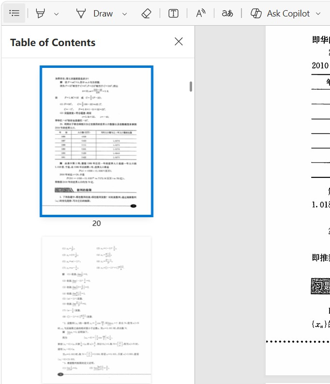
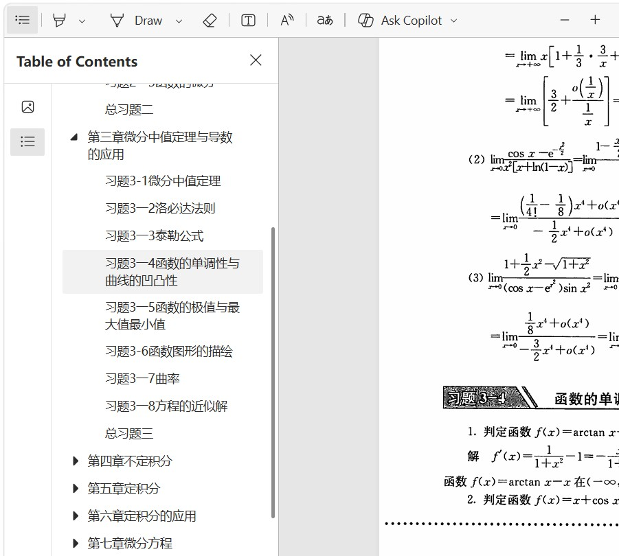

# TOC Forge — Automatic PDF Bookmark Generator

[中文说明](README_zh.md) | English

TOC Forge automatically converts the visible **table of contents in a PDF into clickable PDF bookmarks**. It detects TOC pages, extracts titles and printed page numbers with PaddleOCR or an optional LLM, reconstructs the chapter hierarchy, corrects page-number offsets, and writes a new PDF with a navigable outline.

Use it to **add bookmarks to scanned PDFs**, make a PDF table of contents clickable, or generate a PDF outline for an ebook, textbook, paper, or technical document that has TOC pages but no bookmarks.

> 中文简介：自动识别扫描版或电子版 PDF 的目录页，并将目录转换为可点击、可跳转的层级书签。

## Before and after

| PDF without bookmarks | PDF with bookmarks generated by TOC Forge |
| --- | --- |
|  |  |

The source PDF is not overwritten. By default, the result is saved as `output/<original-name>_bookmarked.pdf`.

## Features

- **Automatic TOC detection:** finds single-page and multi-page tables of contents without requiring page numbers from the user.
- **TOC-to-bookmark conversion:** extracts titles, page numbers, indentation, and hierarchy, then writes native PDF outline entries.
- **Scanned and digital PDFs:** processes page images, so a searchable text layer is not required.
- **Chinese and English support:** geometry-driven parsing works with both languages and common numbering styles.
- **Page-number correction:** handles the offset between printed page numbers and PDF page indices, including Roman-numeral front matter and page numbers such as `I-1` and `II-3`.
- **Blank-page-aware mapping:** automatically skips blank or unnumbered pages and recalculates the offset for bookmarks that follow them.
- **Three extraction modes:** fully local OCR, local OCR plus a text LLM, or direct vision-LLM extraction.
- **Privacy-friendly local mode:** the default mode does not upload PDF content to an external API.
- **CLI, Windows desktop GUI, and local Web UI.**
- **Result caching:** repeated processing reuses layout, OCR, and optional LLM results.

## How it works

```text
PDF → detect TOC pages → OCR or vision LLM → rebuild TOC hierarchy
    → map printed page numbers → write clickable PDF bookmarks
```

TOC Forge does not generate a table of contents from the document body. The input PDF must already contain one or more visible TOC pages.

## Requirements

- Python 3.10 or later
- Windows or Linux; the packaged desktop workflow is designed for Windows
- Internet access on the first run to download PaddleOCR/PaddleX models
- An API key only when using text-LLM or vision-LLM mode

OCR models are large, and local inference can be CPU- and memory-intensive. Subsequent runs are usually faster because intermediate results are cached.

## Installation

Clone the repository and create a virtual environment:

```bash
git clone https://github.com/electroniccc/toc_forge.git
cd toc_forge
uv venv .venv
```

Activate it on Windows PowerShell:

```powershell
.\.venv\Scripts\Activate.ps1
```

Or on Linux/macOS:

```bash
source .venv/bin/activate
```

Install the CLI:

```bash
uv pip install .
```

You can use `pip install .` instead if you do not use `uv`.

## Quick start: local OCR

No LLM or API key is required:

```bash
toc-forge --input book.pdf --output output
```

The equivalent module command is:

```bash
python -m toc_forge --input book.pdf --output output
```

On CPU, the smaller OCR models can reduce processing time:

```bash
toc-forge --input book.pdf --output output --device cpu --ocr_model_size mobile
```

On Windows, if the Paddle engine reports a oneDNN/MKLDNN error, use:

```powershell
toc-forge --input book.pdf --output output --device cpu --disable_mkldnn
```

## Optional LLM modes

TOC Forge accepts OpenAI-compatible API endpoints. The mode is selected automatically from the supplied model option.

### Local OCR + text LLM

Local OCR reads the TOC first; the OCR result is sent to a text model to reconstruct the hierarchy:

```powershell
$env:OPENAI_BASE_URL = "https://your-provider.example/v1"
$env:OPENAI_API_KEY = "your-api-key"
toc-forge --input book.pdf --output output --llm_name your-text-model
```

### Vision LLM

TOC page images are sent directly to a vision-capable model:

```powershell
$env:OPENAI_BASE_URL = "https://your-provider.example/v1"
$env:OPENAI_API_KEY = "your-api-key"
toc-forge --input book.pdf --output output --vllm_name your-vision-model
```

Replace the PowerShell assignments with `export OPENAI_BASE_URL=...` and `export OPENAI_API_KEY=...` on Linux/macOS.

| Mode | External API | Recommended for |
| --- | --- | --- |
| Local OCR | No | Privacy, offline processing after model download, common TOC layouts |
| OCR + text LLM | Yes; sends OCR text/geometry | Noisy OCR or hierarchy that local rules cannot recover |
| Vision LLM | Yes; sends TOC page images | Complex visual layouts and multimodal models |

## Windows desktop GUI

Install the GUI dependencies and start the application:

```powershell
uv pip install ".[gui]"
python .\gui_app.py
```

Choose a PDF, select an output directory, and click **Download / Verify Models** on the first run. The GUI uses ONNX Runtime with mobile OCR models on CPU and supports selecting multiple PDFs.

## Local Web UI

```bash
uv pip install ".[web]"
python web_app.py
```

The browser opens at `http://127.0.0.1:8000`. Uploaded files are processed locally by the running server.

## Useful CLI options

| Option | Description |
| --- | --- |
| `--input PATH` | Input PDF; required |
| `--output DIR` | Output directory; default: `output` |
| `--device cpu|gpu|gpu:0` | PaddleOCR inference device |
| `--engine onnxruntime` | Use the ONNX Runtime inference engine |
| `--ocr_model_size server|mobile` | Higher-accuracy server models or faster mobile models |
| `--toc_detect_max_page N` | Maximum number of initial pages scanned for a TOC |
| `--cache_dir DIR` | OCR and layout cache directory |
| `--no_toc_cache` | Re-run the LLM instead of using a cached TOC tree |
| `--debug` | Save intermediate images and JSON for troubleshooting |

Run `toc-forge --help` for the complete option list.

## Supported documents and limitations

TOC Forge is intended for books, ebooks, papers, manuals, and other PDFs whose TOC contains titles and page numbers. It supports scanned pages, multi-page TOCs, Chinese and English text, Arabic page numbers, Roman-numeral front matter, and several non-standard page-number formats.

Results still depend on scan quality and TOC layout. Handwritten contents, severely cropped pages, decorative layouts, missing page numbers, or documents without a visible TOC may require an LLM mode or manual correction. Always review the generated bookmarks before distributing the PDF.

## FAQ

### How can I automatically add bookmarks to a scanned PDF?

Run TOC Forge on a PDF that contains visible table-of-contents pages. It uses OCR to extract the TOC and saves a separate PDF containing clickable bookmarks; a searchable text layer is not required.

### Can it convert an existing PDF table of contents into bookmarks?

Yes. This is the primary purpose of TOC Forge: converting an existing printed or scanned TOC into a native hierarchical PDF outline.

### Does it work without ChatGPT, Claude, DeepSeek, or another LLM?

Yes. Local OCR is the default mode and does not call an external LLM. An OpenAI-compatible text or vision model is optional when a TOC is difficult to parse locally.

### Does it change the original PDF?

No. It creates a new file named `<original-name>_bookmarked.pdf` in the selected output directory.

### Why do bookmarks sometimes point to the wrong page?

Printed page numbers often differ from PDF page indices because of covers, front matter, and blank or unnumbered pages inserted between chapters. TOC Forge estimates the offset automatically, skips unnumbered blank pages, corrects subsequent bookmark positions, and supports Roman and segmented numbering. Unusual layouts or poorly scanned page numbers can still need manual verification.

## Troubleshooting

- Use `--debug` and inspect the generated images/JSON if no TOC is detected.
- Increase `--toc_detect_max_page` when the table of contents appears late in the PDF.
- Try `--ocr_model_size server` for accuracy or `mobile` for CPU speed.
- Use `--no_toc_cache` after changing an LLM model or endpoint.
- Runtime logs are written to `log/toc_forge.log` by default.

## License

[MIT License](LICENSE)
